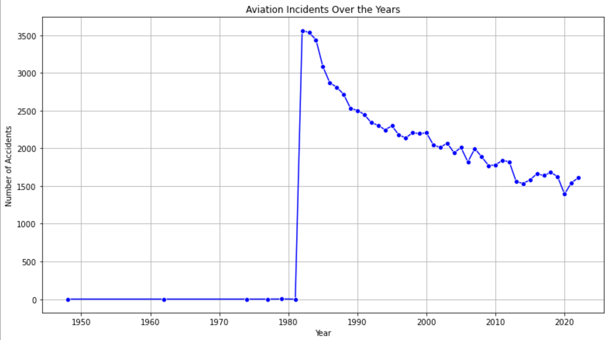
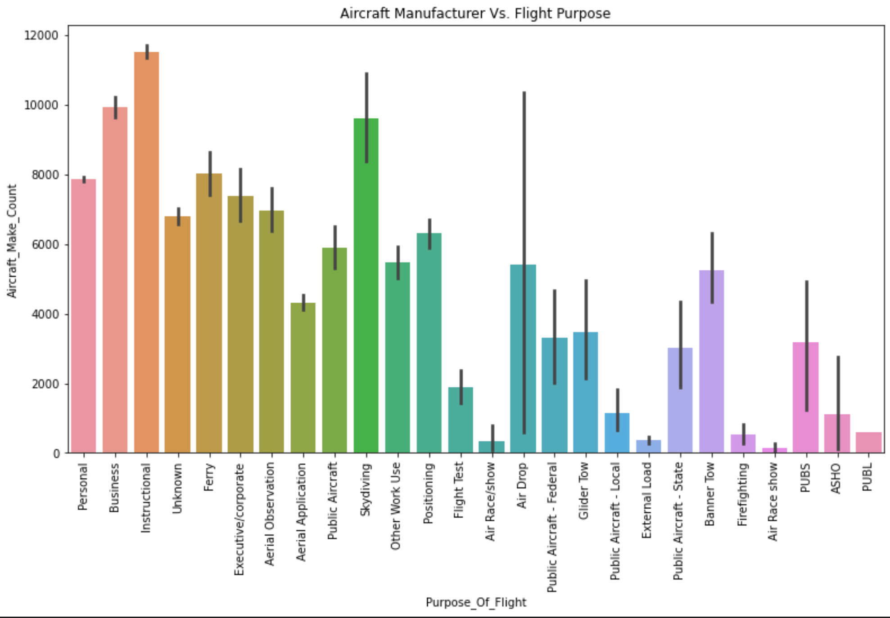

# 🚀 Phase 1 Project: Aviation Risk Assessment for Potential Investment

## Project Overview
This project aims to examine aviation accidents and assess risk factors associated with aviation incidents using statistical data analysis, as well as data visualization techniques. By leveraging Data Analysis methods, we aim to explore correlations between aircraft characteristics, injury severity, weather conditions and geographical accident distributions.

## Objectives
1. __Identify Low-Risk Aircraft Models & Manufacurers -__ Analyze accident trends to determine the safest aircraft options fot business operations
2. __Evaluate Risk Factors Influencing Aircraft Safety -__ Investigate the role of mechanical failures, pilot error, weather conditions, and other factors in aviation incidents
3. __Provide Actionable Insights for Decision-Making -__ Translate data-driven findings into strategic recommendations for the company's Aviation division.

## Dataset Summary
The [Aviation Accident Database & Synopses](https://www.kaggle.com/datasets/khsamaha/aviation-accident-database-synopses) dataset from __Kaggle__ consists of Aviation accident reports from 1948 to 2024, with the following key features:
- __Aircraft Information:__ Make, Model, Number of Engines, Engine Type, and Aircraft Damage Information.
* __Flight Metadata:__ Phase of Flight Information (Takeoff, Cruising, Landing), Weather Condition.
- __Injury Data:__ Types of Injuries, including Fatal Injuries, Serious Injuries and Minor Injuries, as well as the total number of Uninjured.
* __Geographical Data:__ Latitude, Longitude, and Country Information.

## Tools and Libraries Implemented
- __Python:__ Main programming language used for Data manipulation and visualization.
* __Pandas & Numpy:__ Used for Data Loading, Data Cleaning and analysis (Exploratory Data Analysis, EDA).
- __Matplotlib & Seaborn:__ Used for Data visualization plots (bar plots, hearmaps, time-series plots)
* __Tableau:__ Used for further Data Visualization, as well as developing an interactive dahboard.

## Data Preprocessing techniques
- Dealing with missing values, standardization of columns and ensuring correct column data type formats
* Generating columns with numerical data for categorical columns where necessary.
- Normalizing numerical columns for better visualizations.

## Key Visualizations & Insights
1. __Accident Trend Analysis Over Time__
    - Time-series (line) plot to analyze trends in accident incidents over the years.
    * This helps in identifying peak accident periods.

 

2. __Number of Accidents by Aircraft Manufacturers__
    - A horizontal bar plot to investigate the number of accidents by different aircraft manufacturers.
    * This helps in examining the aircraft manufacturers with the highest number of accidents, and look more into the structure of their aircrafts, including the avionics, quality of the engines, etc.

3. __Correlation Heatmap__
    - This plot helps in investigating the relationship between different attributes such as injury severity and aircraft attributes like number of engines.
    * In this case, the heatmap looks at the correlations between Fatal Injuries, Serious Injuries, Minor Injuries, Total Uninjured and Number of Engines.

4. __Purpose of Flight by Aircraft Manufacturer__
    - A bar plot that illustrates the different flight purposes bu the aircraft manufacturer count.
    * It gives insights into how aircraft manufacturers design and produce aircrafts based on different purposes, such as Business, Aerial Observation, Flight Test, Firefighting, etc.

5. __Tableau Interactive Dashboard__
    - An interactive dashboard developed on Tableau based on the cleaned Aviation dataset.
    * This plot gives more insights into various aspects of the data, such as `Aircraft Damage by Number of Engines`, `Total Fatal Injuries & Uninjured by Phase of Flight`, `Total Fatal Injuries by Country`, etc.
    - From this dashboard, business stakeholders are able to draw valuable insights on trends in aviation incidents, and take measures to mitigate the risks involves.

The Tableau interactive dashboard can be found in the [Tableau Public Webpage](https://public.tableau.com/app/profile/patrick.maina2481/viz/AviationRiskAssessment/TotalInjuredandTotalUninjuredvsYear?publish=yes)

## Conclusions & Recommendations
### Conclusion
This analysis provides valuable insights into the aviation accidents dataset. By visualizing the data using various plots, we can gain a deeper understanding of the frequency of accidents, the severity of injuries, the impact of weather conditions, and the relationship between various factors. By identifying patterns and trends, we can better prepare for and respond to potential accidents.

### Recommendations:
- Since most accidents take place during Takeoff and Landing from my analysis, it is important to emphasize comprehensive pilot training, and enhanced aircraft landing systems.
- Because aircrafts with multi-engine systems tend to have higher survival rates, I would suggest looking into aircrafts with engine redundancy, since it plays a crucial role in aircraft safety.
- From my analysis, adverse weather conditions contribute significantly to increased accident rates, therefore it is paramount to consider weather conditions when deploying aircrafts to the sky.

